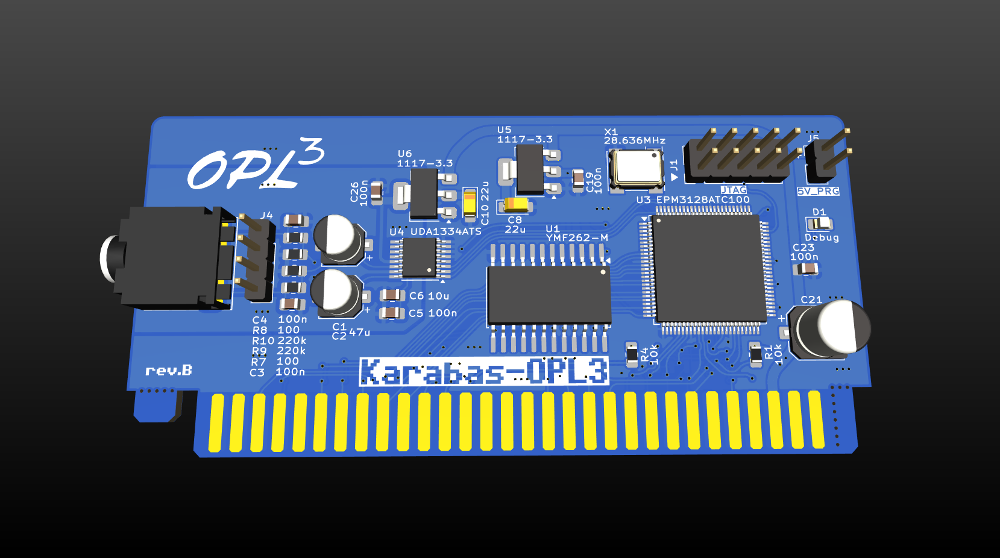
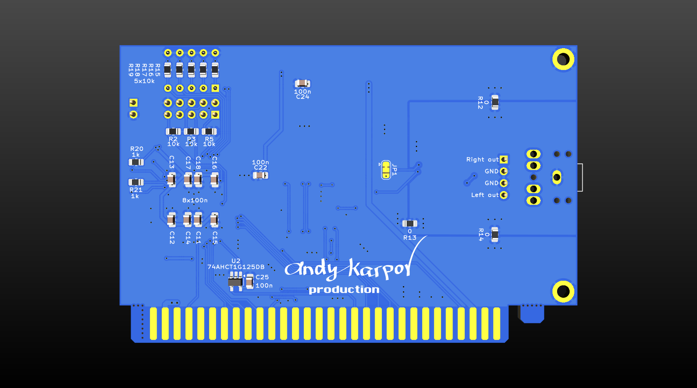

## Karabas-OPL3

Simple OPL3 sound card for ZX Spectrum (NemoBus).

### Tech specs

* OPL3 sound by YMF-262-M
* 16-bit DAC UDA1334A
* EPM3128 CPLD
* Low profile PCB: 98x64mm
* 5V only power required

### Changelog & current status

* Rev.A - initial release. Please note the [errata](pcb/revA/ERRATA.txt);

### Related projects

* ZX-Multisound - [link](https://github.com/UzixLS/zx-multisound)
* Turbo Sound FM - [link](http://www.nedopc.com/TURBOSOUND/ts-fm.php)
* ZXM-SoundCard - [link](http://micklab.ru/My%20Soundcard/ZXMSoundCard.htm)
* ZXM-GeneralSound - [link](http://micklab.ru/My%20Soundcard/ZXMGeneralSound.htm)
* NeoGS - [link](http://www.nedopc.com/gs/ngs.php)
